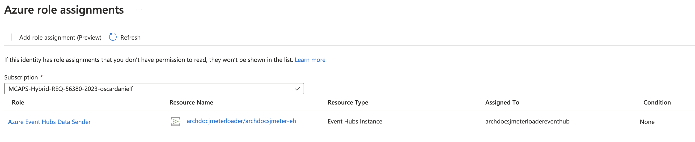

# Azure Load Testing Plugins

This document explains how to use the plugins designed for Azure services in Azure load testing or JMeter servers.

## Load Testing

JMeter or JME is an open-source Java-based load testing framework that is
easily extendible. The load test can be executed in GUI and non GUI mode. In GUI mode, JMeter needs to setup in a VM or local dev environment.
In non-GUI mode, we pass all required components along with a JMX file and then the server will execute the load as per specified steps in JMX file.

### How to setup JMeter in GUI mode

This setup instruction is only for Mac but JMeter can also easily be installed in Windows.

1. Install Microsoft build of OpenJDK from [here](https://www.microsoft.com/openjdk)
1. Run `brew install jmeter` command to install JMeter package or download and install it from [Apache](https://jmeter.apache.org/download_jmeter.cgi).
1. Run `jmeter` to load Jmeter GUI application for running load testing in local dev environment.
1. Load JMX file and provide thread group and plugin configuration variables using GUI and run the test.

### How to setup Visual Studio Code for Eventhub plugin development

Follow the instruction below to setup local development environment for Eventhub plugin development:

1. Install Maven extension for Java from Microsoft
1. Use Maven extensions to build Jar file for Eventhub plugin.
1. Edit plugin source code and compile the code using Maven.
1. Manually copy the shaded Jar file (loadtestplugins-1.0.jar) to JMeter plugins folder located in `/opt/homebrew/Cellar/jmeter/5.5/libexec/lib`.
1. Run `jmeter` locally and open and run JMX file same as before. JMX file has a reference to GUI class and sampler class resided in the JAR file.
Note that this folder can be different based on brew and JMeter version.

### How to use plugin in GUI mode to design a JMX file

In order to use the plugin, as mentioned in the previous section, the JAR file needs to be installed using plugin manager
or manually copy the file to the JMeter plugin manager folder. If you copy the JAR file manually,
you will need to add the following lines to your JMX file:

```xml
    <hashTree>
        <com.microsoft.eventhubplugin.EventHubPlugin guiclass="com.microsoft.eventhubplugin.EventHubPluginGui" testclass="com.microsoft.eventhubplugin.EventHubPlugin" testname="Azure Event Hubs Sampler" enabled="true">
          <boolProp name="useManagedIdentity">false</boolProp>
          <stringProp name="eventHubConnectionVarName">EventHubConnectionString</stringProp>
          <stringProp name="eventHubName">telemetry-data-changed-eh</stringProp>
          <stringProp name="liquidTemplateFileName">StreamingDataTemplate.liquid</stringProp>
        </com.microsoft.eventhubplugin.EventHubPlugin>
    <hashTree/>
```

After adding the line above to the JMX file, open in JMX GUI and edit the variables and define all required steps for your load testing and
add any other JMeter plug as needed.

This plugin has three variables as below:

1. eventHubConnectionVarName: to specify the connection string variable name for event hub that can passed to
the plugin using environmental variable or as Key Vault,
1. eventHubName: event hub name in the event hub name space
1. liquidTemplateFileName: location of a liquid template file which will be used by plugin to render the content of a payload to send to event hub
([more about liquid template](https://shopify.github.io/liquid/)).
Here is an example of [a JMX](/samples/eventhubplugin/LoadTest.jmx)
and [a liquid template](/samples/eventhubplugin/StreamingDataTemplate.liquid) files.

### How to use Eventhub plugin in Azure Load Testing

After completing the JMX file and testing it using in GUI mode, upload the JMX file along with JAR file and the liquid template to Azure load test and
then follow the steps provided [here](https://learn.microsoft.com/en-us/azure/load-testing/quickstart-create-and-run-load-test) to setup Azure load testing.

#### How to enable Managed Identity in Azure Load Testing

Using Managed Identity over Connection Strings is a best practice for enhanced security and manageability. Follow these steps to enable Managed Identity:

1. Add the `useManagedIdentity` and `eventHubNamespace` properties to your JMX file:

    ```xml
        <hashTree>
            <com.microsoft.eventhubplugin.EventHubPlugin guiclass="com.microsoft.eventhubplugin.EventHubPluginGui" testclass="com.microsoft.eventhubplugin.EventHubPlugin" testname="Azure Event Hubs Sampler" enabled="true">
              <boolProp name="useManagedIdentity">true</boolProp>
              <stringProp name="eventHubNamespace">telemetry-ehn.servicebus.windows.net</stringProp>
              <stringProp name="eventHubName">telemetry-data-changed-eh</stringProp>
              <stringProp name="liquidTemplateFileName">StreamingDataTemplate.liquid</stringProp>
            </com.microsoft.eventhubplugin.EventHubPlugin>
        <hashTree/>
    ```

1. [Assign an identity to your load testing resource](https://learn.microsoft.com/en-us/azure/load-testing/how-to-use-a-managed-identity?tabs=azure-portal) so it can send events to the target Event Hub using the `Azure Event Hubs Data Sender` role. Here is an example of how it looks after setting the role assignments:

    

1. When setting the test plan, make sure to select the engine identity as `System Managed Identity`.
